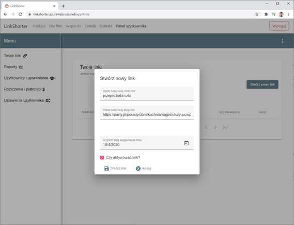
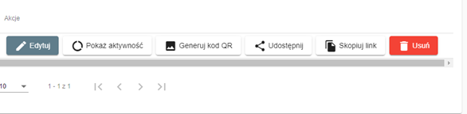
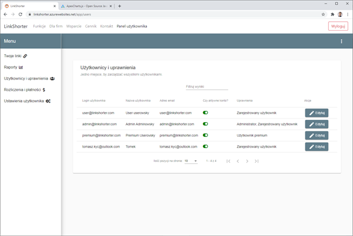

# diploma-project
This repository describes my Computer Science B. Eng. diploma project. 

## Project description

This project was a main topic of my diploma project. I make an url-shorter web app with a lot of integrations (social media sharing buttons, REST API integration, payments integrations and many more). As you can see the app frontend and some part of backend are in Polish but it was required to make the app as main diploma project. 

Below description of tech stack of the project: 

### backend: 

- Spring Boot
- Hibernate
- Docker
- Maven
- JUnit
- Swagger
- Lombock

### frontend: 

- Angular
- npm
- Angular Material
- Bootstrap
- ApexChartsJS

### database:

- SQL Server
- H2 database (for tests purpose)

Whole project (backend, frontend, database) was dockerized to make the project running within separate env and with just few commands.

## Installation

Walk throught the repositories: 

- [backend](https://github.com/tomaszkyc/my-link-shorter-api)
- [frontend](https://github.com/tomaszkyc/my-link-shorter-ui)

to get more info about project structure and installation details.

## Project look and feel

Below some screenshots from application:

## Contributing

Contribution is disabled and the project will not be developed in future.

## License
[MIT](https://choosealicense.com/licenses/mit/)